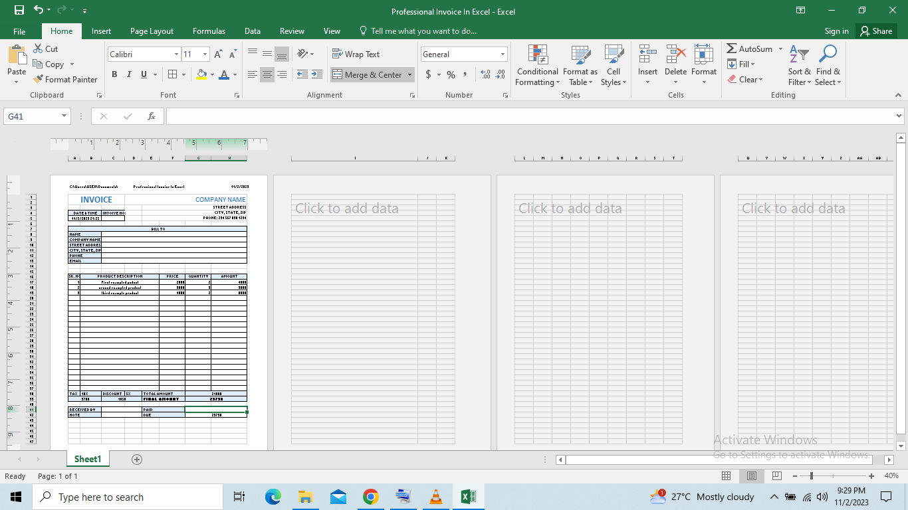

# Invoice-Using-Excel

This project was done in other to understand automation in Excel, this was done by using some functions such as follows;
1. SUM function
2. IF function
3. Arithmetic Operator

The invoice was also design to give a professional experience.

   
